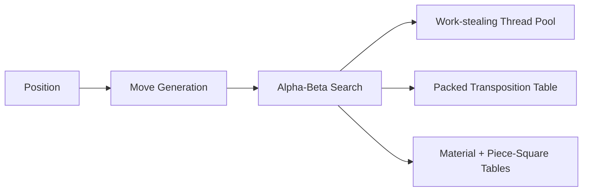

# Chess Engine

A from-scratch C++20 chess engine: bitboard move generation, alpha-beta search, and a custom work-stealing parallel search.

## Highlights

- **Board** — Twelve piece bitboards, game state packed into 32 bits, incremental Zobrist hashing. Apply/undo toggles only the squares that changed, instead of copying the position.
- **Move generation** — Knight, king, and sliding attacks from precomputed tables. Legal moves from any FEN.
- **Search** — Alpha-beta with iterative deepening and quiescence. The transposition-table move is tried first, then captures by MVV-LVA, so the window shrinks early.
- **Parallel search** — Young Brothers Wait: the first child is searched on the owner thread so alpha/beta can tighten; remaining siblings are stolen by idle workers. Best score at a split is published with a lock-free CAS. Helpers copy the position into their own context. Idle workers pull from a Chase-Lev deque per thread (owner LIFO, thieves FIFO).
- **Transposition table** — About a million 12-byte entries (key fragment, score, bound, depth, best move packed together). Search stores results and tries the remembered move first.

## Architecture



`Position` owns the bitboards, a packed `BoardState`, and the Zobrist hash. Evaluation is material plus piece-square tables. When there is more than one worker and remaining depth is at least 4, `Searcher` splits; helpers never mutate a shared board.

## Performance

Apple M4, 16 GB RAM, macOS Sequoia.

| Benchmark           | 1 thread            | 4 threads           |
| ------------------- | ------------------- | ------------------- |
| **Move generation** | **~43,000,000** nps | —                   |
| **Search**          | **~5,000,000** nps  | **~18,000,000** nps |

Move generation is single-threaded (perft 6 from the starting position). Search nps is nodes visited from the starting position at depth 8. Worker count is configurable; 4-thread nps is throughput, not wall-clock speedup.

## Build

C++20, CMake 3.20+, no runtime dependencies.

```bash
git clone https://github.com/noah-yared/chess-engine.git
cd chess-engine
cmake -S . -B build -DCMAKE_BUILD_TYPE=Release
cmake --build build -j
```

## Usage

From `build/`:

```bash
fen="rnbqkbnr/pppppppp/8/8/8/8/PPPPPPPP/RNBQKBNR w KQkq - 0 1"
./engine --perft -d 6
./engine --find-best "$fen" -d 6
./engine --legal-moves "$fen"
./engine --simulate -n 20 -d 5
```

## Tests

```bash
ctest --test-dir build
```

Covers perft, move generation, apply/undo, check detection, search (including 1-vs-N worker score parity), and the work-stealing pool. Microbenchmarks are `./bench_move_gen`, `./bench_search`, and the other `bench_*` binaries in `build/`. [`scripts/`](scripts/) also cross-checks move generation against `python-chess`.

## Layout

```
src/board/          bitboards, position, Zobrist
src/move/           generation, make/unmake
src/search/         alpha-beta, TT, Young Brothers Wait
src/concurrency/    Chase-Lev pool
src/eval/           material + piece-square tables
src/app/            CLI
```
